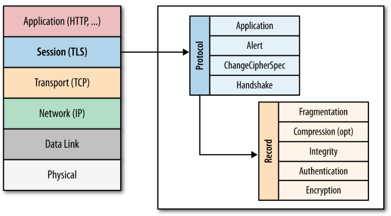
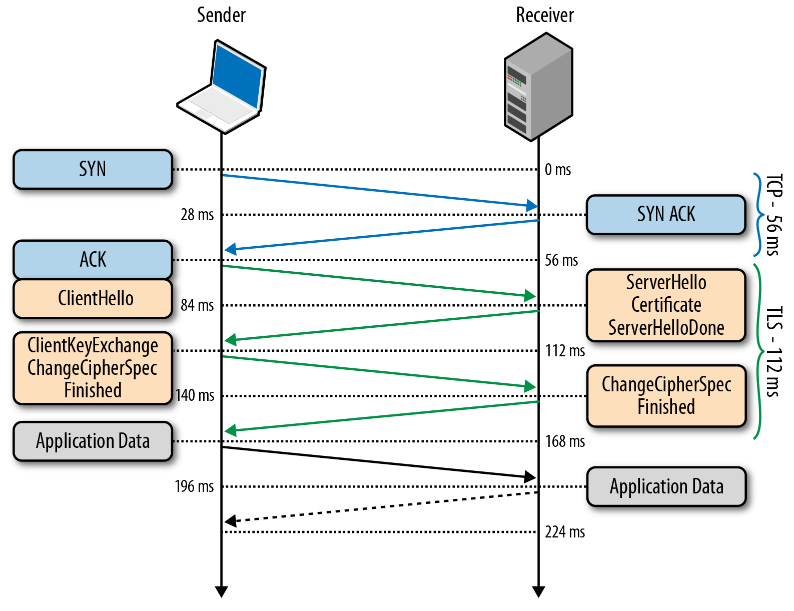
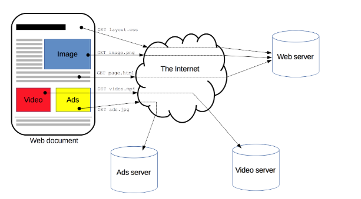
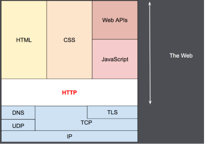
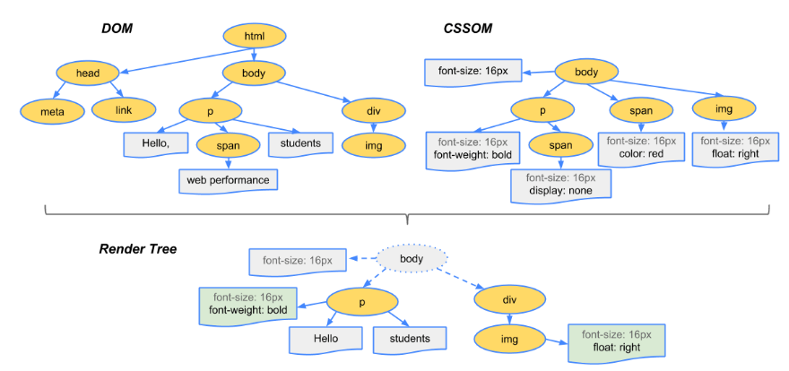

# Веб-заметки

Полезные основы для веб-разработчика.

## 1. DNS. Рекурсивный поиск адреса. DNS over HTTPS.

### 1.1 Что такое DNS?

**DNS** - система доменных имен - технология интернет-среды для хранения информации о доменных зонах. 
Чаще всего используется для преобразования имени сайта в IP-адрес сервера.

### 1.2 Рекурсивный поиск адреса.

**Схема работы с DNS запросами:**

В DNS имеются следующие типы запросов: **итеративный** (он же прямой), **обратный** и **рекурсивный**.

**Итеративный** (он же прямой, он же нерекурсивный) запрос посылает доменное имя DNS серверу и просит вернуть либо IP 
этого домена, либо имя DNS сервера, авторитативного для этого домена. При этом, сервер DNS не опрашивает другие 
серверы для получения ответа. Так работают корневые и TLD серверы.

**Рекурсивный** запрос посылает DNS серверу доменное имя и просит возвратить IP адрес запрошенного домена. 
При этом сервер может обращаться к другим DNS серверам.

**Обратный запрос** посылает IP  и просит вернуть доменное имя.

[Подробнее о DNS можно прочитать здесь.](https://habr.com/ru/post/137587/)

### 1.3 DNS-over-HTTPS для шифрования DNS-запросов.

Как известно, протокол DNS (Domain Name System, система доменных имён) не шифрует запросы  и данные передаются 
в открытом виде. DNS-трафик уязвим перед злоумышленниками, т.к. появляется возможность "подслушать" канал связи 
и перехватить незащищенные персональные данные. Интернет-провайдеры могут осуществлять наблюдение за трафиком 
и собирать данные о том, какие сайты вы посещаете.

Для безопасности DNS-трафика были реализованы специальные протоколы **DNS over TLS** и **DNS over HTTPS**.

**DNS over HTTPS**

Когда вы вводите веб-адрес или доменное имя в вашу адресную строку (например, www.mozilla.org), ваш браузер 
отправляет запрос через Интернет с целью поиска IP-адреса для этого веб-сайта.

Традиционно этот запрос отправляется на серверы посредством простого текстового соединения. 
Это соединение не шифруется, позволяя сторонним лицам видеть, какой веб-сайт вы собираетесь посетить.

DNS через HTTPS (DoH) работает иначе. Он отправляет доменное имя, которое вы ввели, на DNS-сервер, 
совместимый с DoH, с помощьюю зашифрованного HTTPS-соединения вместо простого текста. 
Это защищает информацию о том, какие веб-сайты вы собираетесь посетить, от просмотра сторонними лицами.

## 2. Передача пакетов на сетевом и канальном уровнях.

На канальном уровне происходит передача данных в одном сегменте сети. 
Сетевой уровень объединяет эти сегменты в одну крупную составную сеть.

**Адреса**

Канальный уровень: MAC 
Сетевой уровень: IP

**Один сегмент сети**

В одном фрагменте сети, для того, чтобы отправить пакет необходимо знать IP-адрес и MAC-адрес машины в сети. Для этого в сеть отправляется ARP-запрос с IP-адресом, ARP-ответ на который будет соответствие нужного MAC-адреса, на который в дальнейшем отправится пакет. 

**Разные сети**

Теперь, чтобы узнать MAC-адрес, на который передается пакет, нужно:
1. Узнать не находимся ли мы в одной сети.
2. Если получательно находится в другой сети, то пакет передается маршрутизатору.
3. Для этого по протоколу ARP определяется MAC-адрес маршрутизатора.
4. Переданный на маршрутизатор пакет готовится к передаче в следующую сеть.
5. IP-адрес отправителя сохраняется, а MAC-адрес отправителя становится MAC-адресом маршрутизатора.
6. По протоколу ARP находится IP-адрес получателя.

## 3. Maximum Transmission Unit (MTU).

Maximum Transmission Unit - максимальный размер пакета - сколько байт может быть передано в одном пакете.

Значение MTU может повлиять на производительность сети. Например, если у компьютера/роутера и оборудования провайдера значения MTU будут разные, сетевой пакет будет разбит на меньший показатель и если деление не будет ровным, к фрагменту будет добавлен балласт в виде ненужной информации. Поэтому важно, чтобы минимальный размер сетевого фрагмента был кратным показателю на стороне провайдера. В современных подключениях это менее актуально, но в соединениях на основе PPPoE (часто встречается у провайдера Ростелеком) имеет смысл проверить MTU. Также, при низкой производительности сети VPN, в первую очередь, стоит поиграть со значениями MTU.

## 4. TCP-соединение.

### 4.1 Коротко о TCP

Протокол TCP (транспортный уровень модели OSI) обеспечивает:
- Гарантию доставки
- Гарантию сохранения порядка сообщений

Процесс передачи данных TCP:
- Установка соединения
- Передача данных
- Разрыв соединения

### 4.2 Установка TCP соединения

**Шаг 1. Отправка SYN пакета**

Отправляется пакет с выставленным флагом SYN, что означает инициализацию сессии. 
На этом этапе будет задан порт источника и порт назначения .

**Шаг 2. Отправка подтверждения SYN+ACK**

В ответ на этот пакет, сервер, если он не против соединения, посылает пакет с битами SYN,ACK.

**Шаг 3. Отправка подтверждения ACK**

Теперь инициатору подключения не остается ничего другого, как ответить ACK и пояснить, что речь идёт 
об Acknowledgment number предыдущего шага.

---

**Иначе, в переводе с TCP на русский это выглядит так:**

1. Клиент: Кодовое слово “1” (Sequence number), сервер, давай мутить! (SYN); 
2. Сервер: Моё кодовое слово “5” (Sequence number), клиент, на твой запрос по кодовому слову 
“1” (Acknowledgment number) отвечаю (+1) ну давай мутить (SYN+ACK). 
3. Клиент: Ну хорошо! Раз ты, сервер, получай мой окончательный ответ ответ (ACK) 
на твое согласие (5+1) на мой запрос (1+1).

Всё. С этого момента соединение считается установленным. Дальнейшие пакеты будут передавать уже полезную нагрузку – данные протоколов вышестоящих уровней, например SSH.

[Подробнее о процедуре установки TCP-соединения здесь.](https://yandex.ru/turbo?text=https%3A%2F%2Flitl-admin.ru%2Frabota-s-setyu%2Fustanovka-tcp-soedineniya.html)

## 5. TLS и Handshake.

Протокол TLS (transport layer security) предназначен для предоставления трёх услуг всем приложениям, работающим над ним, а именно: шифрование, аутентификацию и целостность. Он основан на протоколе SSL (Secure Sockets Layer), изначально разработанном в Netscape для повышения безопасности электронной коммерции в Интернете.

Протокол SSL был реализован на application-уровне, непосредственно над TCP (Transmission Control Protocol), что позволяет более высокоуровневым протоколам (таким как HTTP или протоколу электронной почты) работать без изменений. Если SSL сконфигурирован корректно, то сторонний наблюдатель может узнать лишь параметры соединения (например, тип используемого шифрования), а также частоту пересылки и примерное количество данных, но не может читать и изменять их.

Конкретное место TLS (SSL) в стеке протоколов Интернета показано на схеме:

 

### TLS Handshake

Перед тем, как начать обмен данными через TLS, клиент и сервер должны согласовать параметры соединения, а именно: версия используемого протокола, способ шифрования данных, а также проверить сертификаты, если это необходимо. Схема начала соединения называется TLS Handshake и показана на рисунке:

 

Разберём подробнее каждый шаг данной процедуры:
1. Так как TLS работает над TCP, для начала между клиентом и сервером устанавливается TCP-соединение.
2. После установки TCP, клиент посылает на сервер спецификацию в виде обычного текста (а именно версию протокола, которую он хочет использовать, поддерживаемые методы шифрования, etc).
3. Сервер утверждает версию используемого протокола, выбирает способ шифрования из предоставленного списка, прикрепляет свой сертификат и отправляет ответ клиенту (при желании сервер может так же запросить клиентский сертификат).
4. Версия протокола и способ шифрования на данном моменте считаются утверждёнными, клиент проверяет присланный сертификат и инициирует либо RSA, либо обмен ключами по Диффи-Хеллману, в зависимости от установленных параметров.
5. Сервер обрабатывает присланное клиентом сообщение, сверяет MAC, и отправляет клиенту заключительное (‘Finished’) сообщение в зашифрованном виде.
6. Клиент расшифровывает полученное сообщение, сверяет MAC, и если всё хорошо, то соединение считается установленным и начинается обмен данными приложений.

## 6. HTTP и процедура передачи заголовков.

HTTP — это протокол, позволяющий получать различные ресурсы, например HTML-документы. Протокол HTTP  лежит в основе обмена данными в Интернете. HTTP является протоколом клиент-серверного взаимодействия, что означает инициирование запросов к серверу самим получателем, обычно веб-браузером (web-browser). Полученный итоговый документ будет (может) состоять из различных поддокументов являющихся частью итогового документа: например, из отдельно полученного текста, описания структуры документа, изображений, видео-файлов, скриптов и многого другого. 
 
Клиенты и серверы взаимодействуют, обмениваясь одиночными сообщениями (а не потоком данных). Сообщения, отправленные клиентом, обычно веб-бруезером, называются запросами, а сообщения, отправленные сервером, называются ответами. 
 
Хотя HTTP был разработан  еще в начале 1990-х годов, за счет своей расширяемости в дальнейшем он все время совершенствовался.  HTTP является протоколом прикладного уровня, который чаще всего использует возможности другого протокола - TCP (или TLS - защищённый TCP) - для пересылки своих сообщений, однако любой другой надежный транспортный протокол теоретически может быть использован для доставки таких сообщений. Благодаря своей расширяемости, он используется не только для получения клиентом гипертекстовых документов, изображений и видео, но и для передачи содержимого серверам, например, с помощью HTML-форм. HTTP также может быть использован для получения только частей документа с целью обновления веб-страницы по запросу (например посредством AJAX запроса).

## 7. Рендеринг web-страницы.

### Последовательность работы браузера для отображения веб-страницы

1. Браузер запрашивает и получает HTML страницу и формирует из нее DOM (Document Object Model).
2. Загружаются и распознаются стили, формируется CSSOM (CSS Object Model).
3. На основе DOM и CSSOM формируется дерево рендеринга. Render tree дублирует структуру DOM, но сюда не попадают невидимые элементы (например — <head>, или элементы со стилем display:none;). 
Render Tree описывает визуальное представление DOM 
 
4. Для каждого элемента render tree рассчитывается положение на странице — происходит layout. Браузеры используют поточный метод (flow), при котором в большинстве случаев достаточно одного прохода для размещения всех элементов (для таблиц проходов требуется больше).
5. Наконец, происходит отрисовка всего этого добра в браузере — painting.
  
### Более просто
1. Обработка HTML-разметки и создание модели DOM.
2. Обработка CSS-файла и создание модели CSSOM.
3. Создание модели визуализации из DOM и CSSOM.
4. Определение формы и расположения объектов, создание макета.
5. Вывод объектов на экран.
  
### Repaint

В случае изменения стилей элемента, не влияющих на его размеры и положение на странице (например, background-color, border-color, visibility), браузер просто отрисовывает его заново, с учётом нового стиля — происходит repaint (или restyle).

### Reflow

Если же изменения затрагивают содержимое, структуру документа, положение элементов — происходит reflow (или relayout). Причинами таких изменений обычно являются:

[Исходная статья. Также советы для оптимизации.](https://habr.com/ru/post/224187/) 
[developers.google.com - подробнее про render tree](https://developers.google.com/web/fundamentals/performance/critical-rendering-path/render-tree-construction?hl=ru)

## 8. Обработка JS в браузере.

JavaScript в браузере выполняется в два этапа:
1. Сначала выполняется весь JS код, поданный браузере.
2. Когда весь код выполнился начинается второй этап (асинхронный). На этом этапе в браузере запускается бесконечный цикл обработки событий - event loop. С помощью него браузер следит происходят ли какие-то события и реагирует на них.

Материалы по теме: 
[YouTube. Event Loop. Jake Archibald 2018](https://youtu.be/j4_9BZezSUA?list=WL) 
[YouTube. Event Loop. 2017](https://youtu.be/8cV4ZvHXQL4)

## 9. Отрисовка сss в браузере.

[Исходный материал.](https://webo.in/articles/all/2009/31-rending-restyle-reflow-relayout/)
